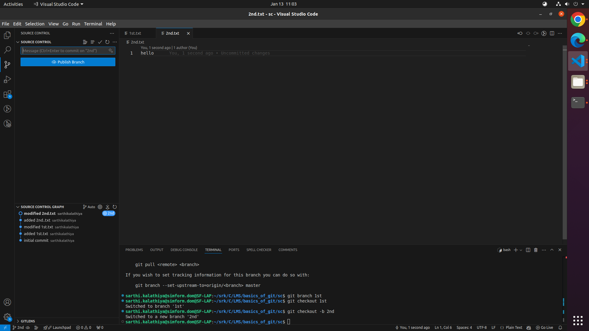

# this repository contains Git-practical Submission

## commands
    git init
Initializes a new Git repository in the current directory.

    git add .
Stages all changes in the current directory for the next commit.

    git commit -m <commit-msg>
Commits the staged changes with the specified commit message.

    git branch
Lists all local branches in the current Git repository.

    git branch -m <new-branch-name>
Renames the current branch to the specified new name.

    git branch <branch-name>
Creates a new branch with the given name.

    git checkout <branch-name>
Switches to the specified branch.

    git log
Displays the commit history of the repository.

    git cherry-pick <hash>
Applies the changes from a specific commit (identified by its hash) to the current branch.

    git tag -a v1.0.0 -m <msg>
Creates an annotated tag with the specified version and message.

    git request-pull [-p] <start> <URL> [<end>]
Generates a request for a pull from a branch in a remote repository.

    git commit --amend -m <new-commit-msg>
Modifies the last commit with a new commit message.

    git reset --hard HEAD~1
Resets the repository to the previous commit, discarding changes in the working directory.

    git push --options
Pushes changes to the remote repository with specific options (e.g., force push).

    git log --oneline --all --graph
Displays the commit history in a concise, graphical format showing all branches.

    git pull
Fetches and merges changes from the remote repository into the current branch.

    git merge
Combines changes from one branch into the current branch.

## learning approach
1) observe that the desired outcome or whatever you are looking for is not there.
2) perform the required task to reach to the outcome.
3) verify that the outcome is there to validate the task which was performed were the right ones.

## Steps

- **step-1**: Create a branch from the develop.
   ```sh
   git branch 1st
   git checkout 1st
to create a branch from the develop and to work on that branch we need to first create the branch if not existing and then switch to that branch.


- **step-2**: Add a commit message hook to the repository.
    ```sh
    git commit -m <commit-msg>


- **step-3**: Perform multiple commits in the new branch.

make changes in the branch and verify the logs accordingly.


- **step-4**: Create PR to develop.

create PR and resolve any conflicts with the branch by selecting either incoming code or outgoing code or both etc.
- **step-5**: PR should be small in size, It's recommended to do one commit per PR. However, based on the situation we can have multiple commits in PR. e.g. if someone is doing 10 bug fixes which are one-liner fixes in such cases instead of 10 different PRs you can do 10 commits in a single PR. 
- **step-6**: Create another branch from develop given your previous PR is still in review state.
    ```sh
    git branch 2nd
    git checkout 2nd 


- **step-7**: Now commit something in your current branch and push it.

by doing commits to this branch we have in total 3 branches and multiple commits in each branch (for visualization).



- **step-8**: In the meantime, your previous PR has been merged to develop.

while merging make sure to resolve the conflicts accordingly if there are any.


- **step-9**: Create a PR for the current branch given your branch should be up to date with develop branch.


- **step-10**: For any new build release add a version tag to that specific commit to keep track of each version.
    ```sh
    git tag -a v1.0.0 -m <release-msg>
Tagging is generally used to capture a point in history that is used for a marked version release (i.e. v1.0.0).
- **step-11**: Create 2 another branch (3rd and 4th) from develop, push read me changes to 3rd brach.
    ```sh
    git branch 3rd
    git branch 4th
    git checkout 3rd
    git commit -m <commit-msg>
before creating branches make sure that you are on the correct branch.


- **step-12**: Cherry pick 3rd branch's commit to 4th branch.
    ```sh
    git checkout 4th
    git cherry-pick <commit-hash>
    git log
way to use : switch to the branch to which you want to add commit, then run the command and verify.

Cherry picking is the act of picking a commit from a branch and applying it to another. git cherry-pick can be useful for undoing changes. For example, say a commit is accidentally made to the wrong branch.
- **step-13**: Change commit message in 4th branch.
    ```sh
    git commit --amend -m <new-commit-msg>
    git log
this command is a convenient way to modify the most recent commit in whichever branch you are and no matter in what way the commit was done.
- **step-14**: add 3 commit to 4th branch and delete last commit.
    ```sh
    git commit -m <commit-msg>
    git commit -m <commit-msg>
    git commit -m <commit-msg>
    git reset --hard HEAD~1
    git push --force


after doing multiple commits and if you find yourself in situation where you want to delete last commit, there are two options:

1. soft reset - this command acknowledges that you want to undo some changes in your Git repo, but also preserve some changes and updates. A developer can pick and choose which resources to discard and which changes to keep and make part of their next git commit.

2. hard reset - this command is typically used when you need to discard all changes in your working directory and staging area, resetting everything to the last commit.